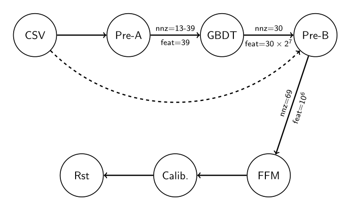
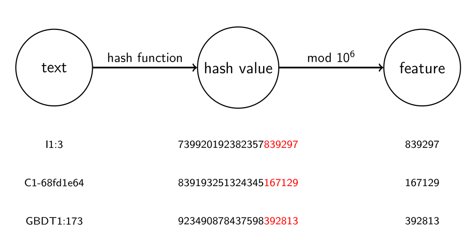

# GBDT+FFM源码详解(排名第一,来自3idiots)

代码地址：  https://github.com/guestwalk/kaggle-2014-criteo

## [README](src/README)

小数据集上使用本工程的方法:
1. 建立两个符号链接(train.tiny.csv与test.tiny.csv分别是训练和测试的小样本):
     ```bash
     $ ln -s train.tiny.csv tr.csv
     $ ln -s test.tiny.csv te.csv
     ```

2. 生成预测结果文件"submission.csv":
    ```bash
     $ run.py
    ```
3. 为需要提交的结果文件生成md5,submission.csv:
    ```
     $ md5sum submission.csv
     19a913d1577c3d419f62e38c34305341  

     submission.csv
    ```

## [Makefile](src/Makefile)
```c
all: gbdt ffm-train ffm-predict

gbdt:
	make -C solvers/gbdt
	ln -sf solvers/gbdt/gbdt

ffm-train:
	make -C solvers/libffm-1.13
	ln -sf solvers/libffm-1.13/ffm-train

ffm-predict:
	make -C solvers/libffm-1.13
	ln -sf solvers/libffm-1.13/ffm-predict

clean:
	rm -f gbdt ffm fc.trva.t10.txt submission.csv *.sp* te.csv tr.csv
	make -C solvers/gbdt clean
	make -C solvers/ffm clean
```
从makefile中可以看出来，由c语言主要实现了三个模块，gbdt,ffm-train,ffm-predict

## [run.py](src/run.py)

```python

# 进程的数量(伪多线程)
NR_THREAD = 1

start = time.time()

#类别特征处理
cmd = './utils/count.py tr.csv > fc.trva.t10.txt'
subprocess.call(cmd, shell=True)
#训练集执行pre-a
cmd = 'converters/parallelizer-a.py -s {nr_thread} converters/pre-a.py tr.csv tr.gbdt.dense tr.gbdt.sparse'.format(nr_thread=NR_THREAD)
subprocess.call(cmd, shell=True)
#测试集执行pre-a
cmd = 'converters/parallelizer-a.py -s {nr_thread} converters/pre-a.py te.csv te.gbdt.dense te.gbdt.sparse'.format(nr_thread=NR_THREAD)
subprocess.call(cmd, shell=True)

#训练集与测试集运行gbdt提取特征
cmd = './gbdt -t 30 -s {nr_thread} te.gbdt.dense te.gbdt.sparse tr.gbdt.dense tr.gbdt.sparse te.gbdt.out tr.gbdt.out'.format(nr_thread=NR_THREAD)
subprocess.call(cmd, shell=True)

cmd = 'rm -f te.gbdt.dense te.gbdt.sparse tr.gbdt.dense tr.gbdt.sparse'
subprocess.call(cmd, shell=True)

cmd = 'converters/parallelizer-b.py -s {nr_thread} converters/pre-b.py tr.csv tr.gbdt.out tr.ffm'.format(nr_thread=NR_THREAD)
subprocess.call(cmd, shell=True)

cmd = 'converters/parallelizer-b.py -s {nr_thread} converters/pre-b.py te.csv te.gbdt.out te.ffm'.format(nr_thread=NR_THREAD)
subprocess.call(cmd, shell=True)

cmd = 'rm -f te.gbdt.out tr.gbdt.out'
subprocess.call(cmd, shell=True)

cmd = './ffm-train -k 4 -t 18 -s {nr_thread} -p te.ffm tr.ffm model'.format(nr_thread=NR_THREAD)
subprocess.call(cmd, shell=True)

cmd = './ffm-predict te.ffm model te.out'.format(nr_thread=NR_THREAD)
subprocess.call(cmd, shell=True)

cmd = './utils/calibrate.py te.out te.out.cal'.format(nr_thread=NR_THREAD)
subprocess.call(cmd, shell=True)

cmd = './utils/make_submission.py te.out.cal submission.csv'.format(nr_thread=NR_THREAD)
subprocess.call(cmd, shell=True)

print('time used = {0:.0f}'.format(time.time()-start))
```
run.py实现的流程图如下图所示：



对照上述图片和代码可以发现，图中gbdt, ffm-predict, ffm-train分别对应于[gbdt](src/solvers/gbdt), [ffm](src/solvers/libffm-1.13)两个模块的实现，在Makefile中对这两个模块的三个函数进行了符号链接.

但是Pre-A与Pre-B的实现是[pre-a.py](src/converters/pre-a.py)与[pre-b.py](src/converters/pre-b.py),在run.py中使用[parallelizer-a.py](src/converters/parallelizer-a.py)与[parallelizer-b.py](src/converters/parallelizer-b.py)进行驱动，目的是数据预处理使用“多线程”(其实使用的subprocess模块进行的实现)，加速数据处理和特征提取。


## 类别特征预处理 [count.py](src/utils/count.py)

```python

for i, row in enumerate(csv.DictReader(open(args['csv_path'])), start=1):
    label = row['Label']
    for j in range(1, 27):
        #只处理C开头的类别特征
        field = 'C{0}'.format(j)
        value = row[field]
        if label == '0':
            counts[field+','+value][0] += 1
        else:
            counts[field+','+value][1] += 1
        counts[field+','+value][2] += 1
    if i % 1000000 == 0:
        sys.stderr.write('{0}m\n'.format(int(i/1000000)))

print('Field,Value,Neg,Pos,Total,Ratio')
for key, (neg, pos, total) in sorted(counts.items(), key=lambda x: x[1][2]):
    # 类别特征出现小于10个，忽略掉
    if total < 10:
        continue
    ratio = round(float(pos)/total, 5)
    print(key+','+str(neg)+','+str(pos)+','+str(total)+','+str(ratio))
```


## 并发数据预处理Pre-A与Pre-B的实现
[parallelizer-a.py](src/converters/parallelizer-a.py),[parallelizer-b.py](src/converters/parallelizer-b.py)这两个文件实现的方式大致相同，作者使用了subprocess开了多个子进程,完成job,过程类似与map的实现方式。


```python
#这里面的类别特征是足够的密集（不稀疏），他们在数据集中出现均超过了400万次，所以我们在GBDT的训练中带有这些特征，这里应该为作者数据分析的结果
target_cat_feats = ['C9-a73ee510', 'C22-', 'C17-e5ba7672', 'C26-', 'C23-32c7478e', 'C6-7e0ccccf', 'C14-b28479f6', 'C19-21ddcdc9', 'C14-07d13a8f', 'C10-3b08e48b', 'C6-fbad5c96', 'C23-3a171ecb', 'C20-b1252a9d', 'C20-5840adea', 'C6-fe6b92e5', 'C20-a458ea53', 'C14-1adce6ef', 'C25-001f3601', 'C22-ad3062eb', 'C17-07c540c4', 'C6-', 'C23-423fab69', 'C17-d4bb7bd8', 'C2-38a947a1', 'C25-e8b83407', 'C9-7cc72ec2']

with open(args['dense_path'], 'w') as f_d, open(args['sparse_path'], 'w') as f_s:
    for row in csv.DictReader(open(args['csv_path'])):
        feats = []
        # 13个数字特征，如果没有填入-10,否则这个数字即为特征的值，记为dense文件
        for j in range(1, 14):
            val = row['I{0}'.format(j)]
            if val == '':
                val = -10
            feats.append('{0}'.format(val))
        f_d.write(row['Label'] + ' ' + ' '.join(feats) + '\n')

        cat_feats = set()
        # 26个类别特征，这一位有值记为1否则记为0，使用稀疏表示方式，记为sparse文件
        for j in range(1, 27):
            field = 'C{0}'.format(j)
            key = field + '-' + row[field]
            cat_feats.add(key)

        feats = []
        for j, feat in enumerate(target_cat_feats, start=1):
            if feat in cat_feats:
                feats.append(str(j))
        f_s.write(row['Label'] + ' ' + ' '.join(feats) + '\n')
```

## gbdt


## pre-b生成ffm训练需要的文件形式 [pre-b.py](src/utils/pre-b.py)
ffm训练数据的文件格式是:
```
<label> <field1>:<index1>:<value1> <field2>:<index2>:<value2> ...
```
即在每一行，第一列是标签，后面每一列由":"分割出三个字段，分别是字段名，索引名和值。




```python
#
def gen_hashed_fm_feats(feats, nr_bins):
    feats = ['{0}:{1}:1'.format(field-1, hashstr(feat, nr_bins)) for (field, feat) in feats]
    return feats

frequent_feats = read_freqent_feats(args['threshold'])

with open(args['out_path'], 'w') as f:
    for row, line_gbdt in zip(csv.DictReader(open(args['csv_path'])), open(args['gbdt_path'])):
        feats = []

        for feat in gen_feats(row):
            field = feat.split('-')[0]
            type, field = field[0], int(field[1:])
            if type == 'C' and feat not in frequent_feats:
                feat = feat.split('-')[0]+'less'
            if type == 'C':
                field += 13
            feats.append((field, feat))

        for i, feat in enumerate(line_gbdt.strip().split()[1:], start=1):
            field = i + 39
            feats.append((field, str(i)+":"+feat))

        feats = gen_hashed_fm_feats(feats, args['nr_bins'])
        f.write(row['Label'] + ' ' + ' '.join(feats) + '\n')
```


## 结果标准化
作者经过各种调参发现，整体的预测和真实结果有一定的偏差，将预测结果减少0.003，log损失可以减少0.0001
```python
with open(args['dst_path'], 'w') as f:
    for line in open(args['src_path']):
        prediction = float(line.strip())
        if prediction > 0.0035:
            prediction -= 0.003
        f.write('{0}\n'.format(prediction))
```
