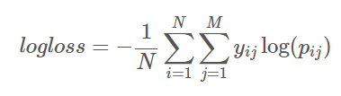
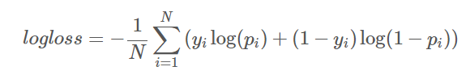

# 广告点击预测(CTR)

https://www.kaggle.com/c/criteo-display-ad-challenge

## 题目简介

广告展示是机器学习应用在互联网产业的核心。但是数据和方法通常都被各个公司所保密。在这个题目中CriteoLabs这个公司共享了一周的数据，方便我们开发预测广告点击率的模型，这道题的目标是解决：给定用户和其访问的网页，他点击一个广告的概率是多少。


这个题目的baseline最准确的ML算法的CTR估计。 所有获奖模式将根据开源许可证发布。 作为参与者，您将有机会访问Criteo的流量日志，其中包括各种未公开的功能以及点击标签。

## 文件内容

train.csv - The training set consists of a portion of Criteo's traffic over a period of 7 days. Each row corresponds to a display ad served by Criteo. Positive (clicked) and negatives (non-clicked) examples have both been subsampled at different rates in order to reduce the dataset size. The examples are chronologically ordered.
test.csv - The test set is computed in the same way as the training set but for events on the day following the training period.
random_submission.csv - A sample submission file in the correct format.

## 字段含义

详细的英文介绍在[data/readme.txt](data/readme.txt)中。

数据一共有1 + 13 + 26列
* 第1列(Label) : 目标变量，点击记为1未点击记为0。
* 第2-14列(I1-I13) : 整数特征，大部分是计数类型的特征。
* 第15-30列(C1-C26) : 类别特征，均是32位的类别hash值。


## 评价标准

评价的标准使用的是log损失函数：



```python
import scipy as sp
# act表示为真值0或者1，pred表示预测的概率值0 <= p <= 1
def logloss(act, pred):
    epsilon = 1e-15
    # 下面两行代码的含义为，
    # 如果概率大于1 - epsilon或者小于0 + epsilon
    # 就设置为这个1 - epsilon或小于0 + epsilon
    #保证log取值的有意义
    pred = sp.maximum(epsilon, pred)
    pred = sp.minimum(1-epsilon, pred)

    # 下面是实现log损失的公式
    ll = sum(act*sp.log(pred) + sp.subtract(1,act)*sp.log(sp.subtract(1,pred)))
    ll = ll * -1.0/len(act)
    return ll
```
R语言实现
```r
MultiLogLoss <- function(act, pred){
  eps <- 1e-15
  pred <- pmin(pmax(pred, eps), 1 - eps)
  sum(act * log(pred) + (1 - act) * log(1 - pred)) * -1/NROW(act)
}
```
## 提交格式

第一列为用户Id,第二列为点击的概率 `0 <= p <= 1`
```
Id,Predicted
60000000,0.384
63895816,0.5919
759281658,0.1934
895936184,0.9572
...
```
